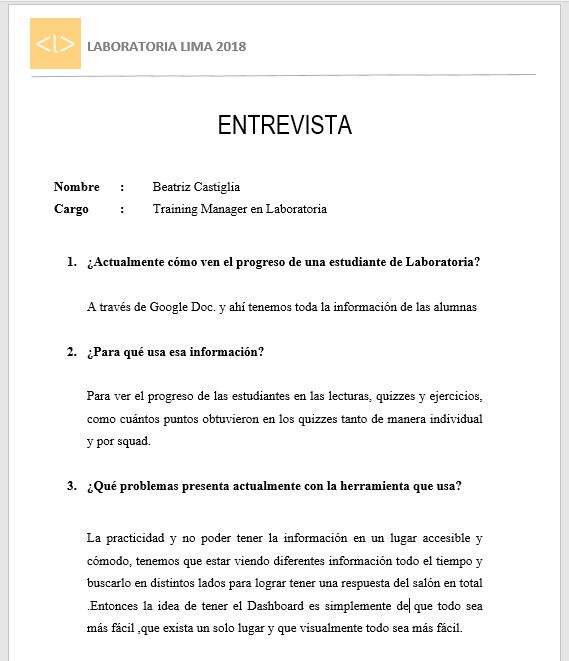
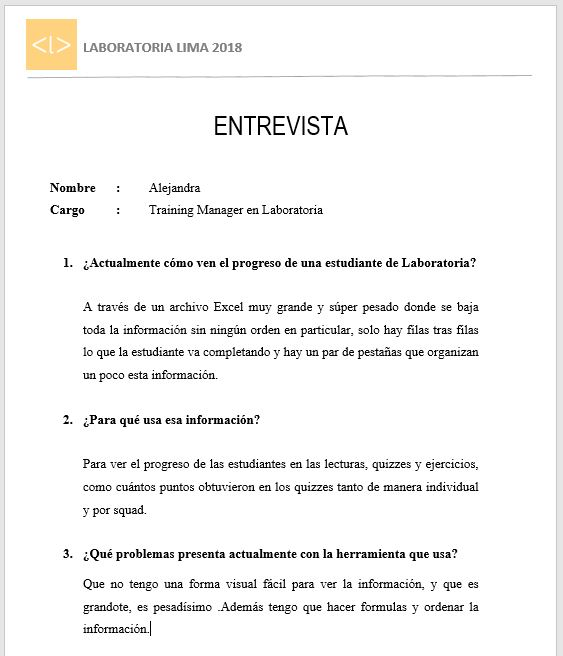
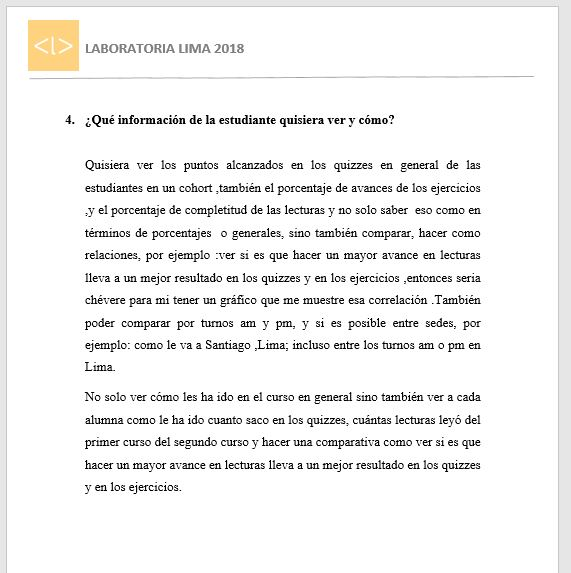
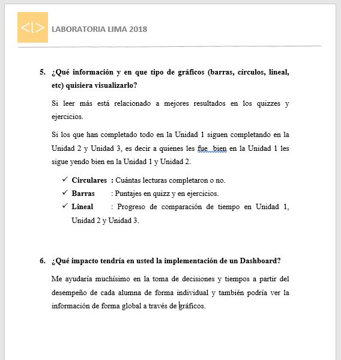
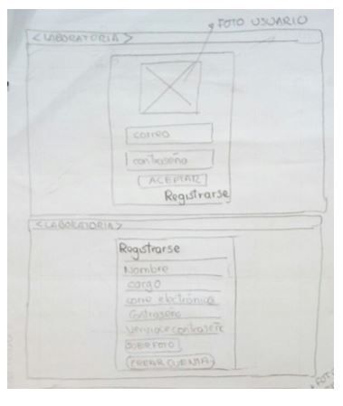
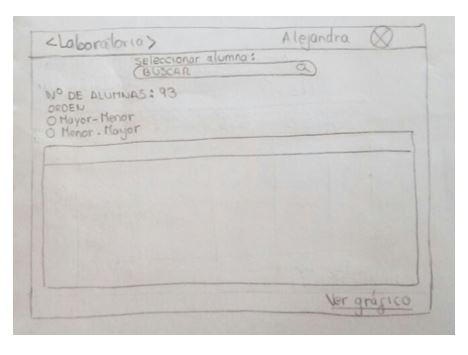

# DATA DASHBOARD

## INTRODUCCIÓN

Según un estudio de IBM, el 90% de la data que existe hoy ha sido creada en los últimos dos años. Cada día generamos 2.5 trillones de bytes de datos, una cifra sin precedentes.

Sin embargo, los datos por sí solos son de poca utilidad. Para transformar datos en información necesitamos procesarlos y entenderlos. Una manera muy sencilla de hacerlo es creando visualizaciones. Las empresas líderes de hoy generan visualizaciones dinámicas de su data que les permiten entender mejor su negocio y tomar decisiones apropiadas.

## DESCRIPCIÓN GENERAL

### DESCRIPCIÓN DEL PROBLEMA

Las Trainning Managers de Laboratoria realizan una labor muy importante pues son las personas encargadas de manipular la data entrante de todas las usuarias de Laboratoria (postulantes, estudiantes, egresadas, etc) de todas las sedes a nivel internacional para que puedan ver la información y el progreso tanto a nivel individual y grupal, además realizan comparativas con otras sedes,para saber como avanzan las usuarias de Laboratoria y poder realizar tomas de decisiones.
Ahora bien, la forma en que las Trainning Managers de Laboratoria vienen trabajando con la data es a través de herramientas como excel, lo cual resulta un poco pesado para ellas pues tienen que ingresar fórmulas, filtrar data, etc para obtener información relevante para poder tomar decisiones, y también no pueden visualizar la data manipulada en gráficos, siendo esto una necesidad muy importante para las Trainning Managers.

### USUARIO PRINCIPAL 

Trainning Managers de Laboratoria.
* Bea Castiglia
* Alejandra

### OBJETIVOS DE LOS USUARIOS EN RELACIÓN CON EL PRODUCTO 

1. Crear un Data Dashboard con la data de todas las usuarias de Laboratoria (postulantes, estudiantes, egresadas,etc)
2. Ver la información global por cada estudiante de quizzes, lecturas, ejercicios.
3. Poder visualizar la información general por cada estudiantes a través de gráficos de la siguiente manera:
  * **Circulares**: Cuántas lecturas completon del total.
  * **Barras**    : Puntaje en quizz y en ejercicios.
  * **Lineal**    : Progreso de comparación de tiempo por cada unidad.
 
### HERRAMIENTA PARA LA RECOPILACIÓN DE INFORMACIÓN

#### ENTREVISTAS

En las siguientes imágenes mostramos las entrevistas realizadas a cada una de las Trainning Managers de Laboratoria para poder recopilar información necesaria para la producción del Data Dasboarh.

* ***Imagen N° 1.*** e ***Imagen N° 2.*** En estas imágenes se muestran las entrevistas realizadas a la  Trainning Manager Bea Castiglia.

   
   

* ***Imagen N° 3.*** , ***Imagen N° 4.*** e ***Imagen N° 5.*** En estas imágenes se muestran las entrevistas realizadas a la  Trainning Manager Alejandra.
  
   
   
   

#### PROTOTIPO DE BAJA FIDELIDAD

Se muestra el prototipo de baja fidelidad según los requerimientos de las Trainnig Managers.

***Imagen N° 6.*** En la siguiente imagen se muestra la interfaz de ingreso y registro de las usuarias (Las Trainning Managers).

   

***Imagen N° 7.*** En la siguiente imagen se muestra la interfaz de selección de paises.

   

***Imagen N° 8.*** En la siguiente imagen se muestra la interfaz de selección de cohorts.

   

***Imagen N° 9.*** En la siguiente imagen se muestra la interfaz de información general de las estudiantes .También se puede apreciar el número total de estudiantes pertenecientes a ese cohort, un buscador de alumanas y además se podrás ordenar la informar de forma ascendente y descente.

   

***Imagen N° 10.*** En la siguiente imagen se muestra la interfaz de información particular por cada estudiante .Se puede apreciar una información más detalla de la estudiante.

   
   
#### DIAGRAMA DE FLUJO

***Imagen N° 11.*** En la siguiente imagen se muestra el Diagrama de Flujo elaborado a partir de la recopilación de datos.

   

#### PROTOTIPO DE ALTA FIDELIDAD

***Imagen N° 12.*** En la siguiente imagen se muestra el prototipo de Alta Fidelidad testeado por las Trainnig Managers de Laboratoria Alejandra y Beatriz.

   